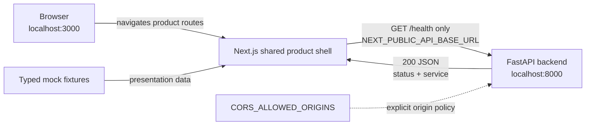

# Architecture

## Current Milestone 2 architecture

Milestone 2 remains a two-process local application. The Next.js application
owns a shared product shell, eight routes, typed mock fixtures, and local UI
interactions. FastAPI still owns only the health endpoint and explicit
development CORS boundary. Neither component has a database, authentication,
scanner, or security-evidence API.

### Request and presentation flow

1. The root route redirects to `/dashboard`; a route-group layout renders the
   shared responsive application shell.
2. Product pages read typed, centralized fixtures without calling a backend.
3. Isolated client components manage navigation, filters, preferences, and the
   explicitly simulated scan interaction.
4. The shell's `ApiStatus` component enters **Checking**, and the reusable
   `getHealth` helper calls the configured FastAPI base URL.
5. FastAPI applies its CORS policy and handles only `GET /health`.
6. A valid `200` response with the expected payload produces **Connected**.
   Network, HTTP, or payload errors produce **Unavailable** without crashing the
   product shell.

### Component responsibilities

| Component | Responsibility | Explicitly not responsible for yet |
| --- | --- | --- |
| Browser/Next.js | Render product routes from typed mock data and manage local presentation state | Authentication, persistence, real scanning, evidence collection |
| Shared product layout | Responsive navigation, demo indicator, workspace context, API status | User sessions, organisation authorization |
| Mock-data boundary | Supply synthetic assets, findings, scans, reports, trends, and integration states | Backend responses or live security evidence |
| API helper | Resolve the public base URL, perform and validate the health request | Secrets, authorization tokens, domain operations |
| FastAPI | Route `/health`, return a minimal payload, enforce configured CORS origins | Scanning, persistence, accounts, AI |
| Environment configuration | Supply the public API location and allowed browser origins | Secret storage or access control |

### Development CORS boundary

The frontend and backend have different origins because their ports differ.
FastAPI allows only the exact configured frontend origins. The default is
limited to the localhost and loopback forms on port 3000. `*` is rejected. CORS
controls browser access to responses; it is not authentication or authorization.

## Future Architecture — Not Yet Implemented

Later milestones may add Supabase-backed persistence, organisation
authorization, verified domains, deterministic scanner workers, and AI-assisted
evidence interpretation. Before scanning exists, the product must establish
authorised organisational/domain control. Deterministic scanners will remain the
source of detection evidence, while AI may later correlate, prioritise, and
explain that evidence.

These systems do not exist in Milestone 2. The current assets, findings, scan
history, reports, integrations, usage, and New Scan progression are all
presentation-only demo data.
