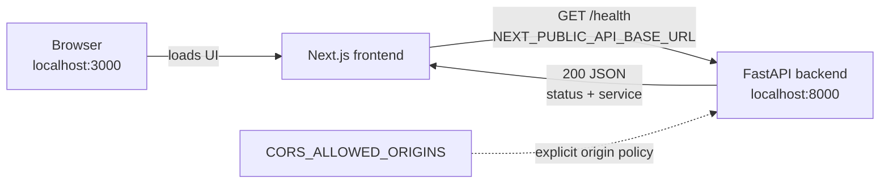

# Architecture

## Current Milestone 1 architecture

Milestone 1 is a two-process local application. The Next.js application owns
presentation and browser-side health-state handling. FastAPI owns the HTTP API,
the health response, and the explicit development CORS boundary. Neither
component has a database or an authentication boundary yet.

### Request flow

1. The browser renders the small Next.js status page.
2. The `ApiStatus` client component enters the **Checking** state.
3. The reusable `getHealth` helper calls the configured API base URL.
4. FastAPI applies its explicit CORS policy and handles `GET /health`.
5. A valid `200` response with the expected payload produces **Connected**.
   Network, HTTP, or payload errors produce **Unavailable** without crashing the
   page.

### Component responsibilities

| Component | Responsibility | Explicitly not responsible for yet |
| --- | --- | --- |
| Browser/Next.js | Render the status page, make the health request, handle UI state | Authentication, dashboards, findings, scan controls |
| API helper | Resolve the public base URL, perform and validate the health request | Secrets, authorization tokens, domain operations |
| FastAPI | Route `/health`, return a minimal payload, enforce configured CORS origins | Scanning, persistence, accounts, AI |
| Environment configuration | Supply the public API location and allowed browser origins | Secret storage or access control |

### Development CORS boundary

The frontend and backend have different origins because their ports differ.
FastAPI therefore allows the exact configured frontend origins. The default is
limited to the localhost and loopback forms on port 3000. `*` is rejected. CORS
controls browser access to responses; it is not authentication or authorization.

## Future Architecture — Not Yet Implemented

Later milestones may add Supabase-backed persistence, organisation
authorization, verified domains, deterministic scanner workers, and AI-assisted
evidence interpretation. Before scanning exists, the product must establish
authorised organisational/domain control. Deterministic scanners will remain the
source of detection evidence, while AI may later correlate, prioritise, and
explain that evidence. These systems do not exist in Milestone 1.

