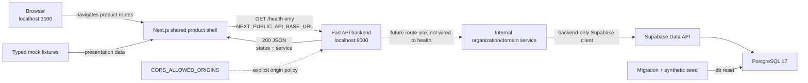

# Architecture

## Current Milestone 3 architecture

The Next.js application still owns the product shell, typed mock fixtures, and
local UI interactions. FastAPI retains the independent health endpoint and now
has an internal, backend-only organization/domain data service. That service
uses the Supabase Data API; PostgreSQL is reconstructed from a versioned
migration and deterministic seed. No database operations are exposed as new
public FastAPI routes, and the browser does not access Supabase.

### Request and presentation flow

1. The root route redirects to `/dashboard`; a route-group layout renders the
   shared responsive application shell.
2. Product pages read typed, centralized fixtures without calling a backend.
3. Isolated client components manage navigation, filters, preferences, and the
   explicitly simulated scan interaction.
4. The shell's `ApiStatus` component enters **Checking**, and the reusable
   `getHealth` helper calls the configured FastAPI base URL.
5. FastAPI applies its CORS policy and handles only `GET /health`; that path
   remains independent of Supabase configuration.
6. A valid `200` response with the expected payload produces **Connected**.
   Network, HTTP, or payload errors produce **Unavailable** without crashing the
   product shell.

### Component responsibilities

| Component | Responsibility | Explicitly not responsible for yet |
| --- | --- | --- |
| Browser/Next.js | Render product routes from typed mock data and manage local presentation state | Authentication, persistence, real scanning, evidence collection |
| Shared product layout | Responsive navigation, demo indicator, workspace context, API status | User sessions, organisation authorization |
| Mock-data boundary | Supply synthetic assets, findings, scans, reports, trends, and integration states | Backend responses or live security evidence |
| API helper | Resolve the public base URL, perform and validate the health request | Secrets, authorization tokens, domain operations |
| FastAPI | Route `/health`, return a minimal payload, enforce configured CORS origins | Database-backed public routes, scanning, accounts, AI |
| Database client factory | Lazily validate backend-only Supabase URL/key configuration and create the official Python client | Browser access, key logging, import-time database requirements |
| Organization service | Create/read organizations and create/list explicitly organization-scoped domains | User authorization or unrestricted tenant queries |
| Supabase/PostgreSQL | Reconstruct schema/seed, enforce relationships and constraints, expose backend Data API | Product APIs, authentication behavior, scanners |
| Environment configuration | Supply public API location, allowed origins, and backend-only database settings | Committed secrets or browser elevation |

### Development CORS boundary

The frontend and backend have different origins because their ports differ.
FastAPI allows only the exact configured frontend origins. The default is
limited to the localhost and loopback forms on port 3000. `*` is rejected. CORS
controls browser access to responses; it is not authentication or authorization.

### Database security boundary

All 11 public application tables have RLS enabled. `anon` and `authenticated`
have no application-table grants or policies in this milestone; only the
backend-only `service_role` can perform CRUD. Composite tenant relationships
prevent a row from referencing a domain, scan, asset, or finding owned by a
different organization. Milestone 4 must add real authentication,
membership-aware `auth.uid()` policies, and FastAPI authorization checks.

## Future Architecture — Not Yet Implemented

Later milestones may connect authorized product operations to persistence, add
verified domains, deterministic scanner workers, and AI-assisted evidence
interpretation. Before scanning exists, the product must establish authorised
organizational/domain control. Deterministic scanners will remain the source of
detection evidence, while AI may later correlate, prioritise, and explain it.

These systems do not exist in Milestone 3. The current assets, findings, scan
history, reports, integrations, usage, and New Scan progression shown in the
browser are all presentation-only demo data.
