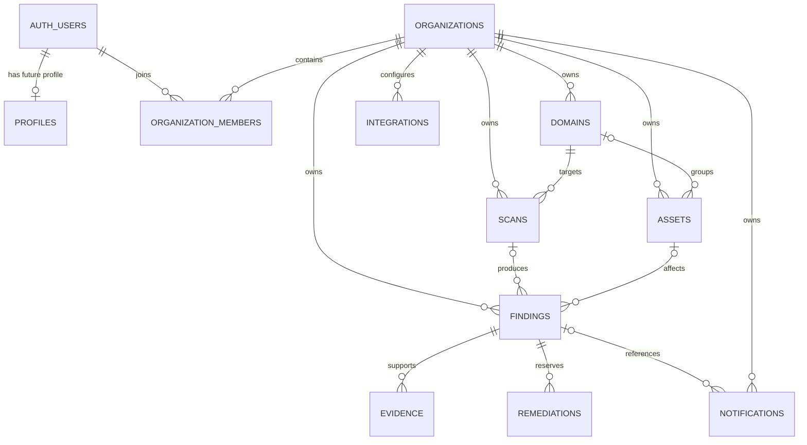

# Database Schema

## Purpose and current boundary

Milestone 3 provides a reproducible, tenant-oriented persistence foundation for
future product work. PostgreSQL stores synthetic development records, and the
backend can exercise a small organization/domain flow through Supabase's Data
API. Authentication, application authorization, ownership verification,
scanning, notification delivery, and browser database access are not
implemented.

## Entity relationships



## Tables and important fields

| Table | Purpose and notable fields |
| --- | --- |
| `profiles` | Future application profile keyed to `auth.users.id`; optional display name and timestamps. |
| `organizations` | Tenant root with UUID, validated name, unique normalized slug, and timestamps. |
| `organization_members` | User-to-organization many-to-many join with composite primary key and constrained `owner`, `admin`, `member`, or `viewer` role. Roles are not yet enforced in application code. |
| `domains` | Tenant-owned normalized hostname with unique organization/hostname pair and internally consistent pending/verified/failed state. No ownership verification exists. |
| `scans` | Future scan record linked to one tenant/domain with constrained lifecycle timestamps and status; no execution exists. |
| `assets` | Future tenant/domain asset using a general `identifier`, constrained type/environment, seen timestamps, and non-sensitive JSON metadata. |
| `findings` | Future tenant-owned observation with optional scan/asset links, severity/status constraints, and seen timestamps. |
| `evidence` | Structured, minimized, redacted JSON attached to a finding with source and observation metadata. |
| `remediations` | Draft/reviewed/archived JSON placeholder for future human-reviewed guidance; no generation or execution exists. |
| `integrations` | Disabled/configured/error metadata for a tenant/provider. It is not a token or secret store. |
| `notifications` | Future delivery record with constrained channel/status and non-sensitive metadata; no delivery occurs. |

All application entity identifiers are UUIDs. Required relationships use
foreign keys; child records normally cascade when their owning organization or
required parent is deleted. Optional finding links to scans/assets and optional
notification links to findings use `ON DELETE SET NULL`, preserving the child
record. A small trigger maintains `updated_at` where that column exists.

## Tenant consistency and indexes

Every tenant-owned table carries `organization_id`. Composite unique keys on
tenant parents and composite foreign keys on domain, scan, asset, and finding
relationships ensure related rows share the same organization. This prevents,
for example, an Organization A finding from referencing Organization B's
asset—even if service code makes a mistake.

Indexes cover organization-scoped access and relationship traversal through
`organization_id`, `domain_id`, `scan_id`, `asset_id`, and `finding_id`.
Organization/timestamp indexes support the expected recent-scan, recent-asset,
recent-finding, and recent-notification views without speculative indexing.

## Evidence and integration safety

Evidence must be structured, minimized, and redacted before persistence. Raw
credentials, tokens, complete secrets, and unnecessarily broad scanner output
must never be stored in `evidence`. The seed contains one explicitly synthetic,
redacted observation with no credential-like material. Integration metadata is
also non-sensitive; OAuth tokens, webhook URLs, and API credentials require a
separately designed secret-storage approach in a later milestone.

## RLS, grants, and future authorization

RLS is enabled on all 11 public application tables. Milestone 3 intentionally
defines no broad anonymous policy and no pretend user-aware policy. Table
privileges are revoked from `anon` and `authenticated`; CRUD is granted only to
`service_role` for the backend-only validation path. Elevated keys must never
reach browser code, logs, committed files, or exceptions.

This is secure-by-default denial, not completed authorization. Milestone 4 must
implement authentication and membership-aware `auth.uid()` RLS policies, plus
FastAPI authorization for each operation. RLS remains defense-in-depth and does
not replace application authorization.

## Migrations and seed workflow

`supabase/migrations/20260815171352_initial_schema.sql` is the versioned source
of the application schema. `supabase/seed.sql` inserts deterministic synthetic
users, profiles, two tenants, memberships, domains, assets, and a small linked
finding/evidence graph. The synthetic auth rows have reserved `.invalid`
addresses, no seeded passwords, and are not used for application login in
Milestone 3.

From the repository root:

```powershell
npx supabase start
npx supabase status
npx supabase migration list --local
npx supabase db reset --local
```

`db reset --local` destroys and rebuilds only the local development database
from migrations and seed. Never use `--linked` without explicit authorization.
Real scanning and authentication remain outside this milestone.

## Backend key handling

The backend requires `SUPABASE_URL` and one elevated server-only key when a
database service is actually used. It prefers `SUPABASE_SECRET_KEY` for hosted
environments and accepts `SUPABASE_SERVICE_ROLE_KEY` for local/legacy CLI
compatibility. The lazy client factory means FastAPI startup and `GET /health`
work without database environment variables. Templates contain names only, not
values; actual `.env` and `.env.local` files remain ignored.
